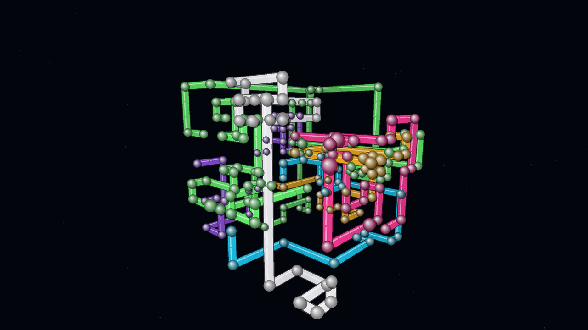

# 3D Pipes Screensaver for Windows



A native-style Windows `.scr` screensaver inspired by the classic Windows 3D Pipes screensaver.

## What it does

- Procedurally generates a fresh three-dimensional pipe layout on every run
- Grows several independently coloured pipes through a 3D grid
- Avoids occupied grid cells and chooses new routes at every junction
- Uses perspective projection, depth sorting, metallic shading, rounded elbows and a slowly rotating camera
- Clears and regenerates the scene after it becomes dense
- Supports Windows screensaver full-screen, settings and Control Panel preview modes
- Covers the complete Windows virtual desktop, including multiple monitors
- Prevents system sleep and display sleep while the screensaver or manual preview is running
- Restores normal Windows power behaviour immediately when it closes
- Includes adjustable speed, pipe count, scene density, camera rotation and keep-awake behaviour

No game engine or third-party runtime is required. The build script uses the C# compiler included with Windows' .NET Framework installation.

## Install

1. Extract the ZIP to a normal folder.
2. Double-click `Install.bat`.
3. Windows Screen Saver Settings will open after installation.
4. Select the desired idle timeout and apply the settings.

The installer compiles `dist\3DPipes.scr`, copies it to `%LOCALAPPDATA%\3D Pipes Screensaver`, and registers it only for the current Windows user. Administrator access is not required.

## Run it manually

- `RunNow.bat` — starts the actual full-screen screensaver immediately
- `Preview.bat` — opens a resizable window, useful while testing settings
- `Build.bat` — builds the `.scr` without installing it
- `Uninstall.bat` — removes the installed screensaver and its saved settings

Press a key, click, or move the mouse to exit full-screen mode. Press **Esc** to close the windowed preview.

## Settings

Open **Windows Screen Saver Settings**, select **3D Pipes**, then choose **Settings**. Available controls:

- Growth interval
- Number of simultaneous pipes
- Scene density before regeneration
- Camera rotation speed
- Keep computer and display awake

Settings are saved under:

`HKEY_CURRENT_USER\Software\ThreeDPipesScreensaver`

## Keep-awake behaviour

While enabled, the application requests both system and display availability from Windows for as long as it remains open. This protects ordinary uploads, file processing and server tasks from idle sleep. Closing the laptop lid, critical-battery actions, forced hibernation, shutdown, or organisation-managed power policies may still override an application's request.

## Screensaver command-line modes

- `3DPipes.scr /s` — full-screen screensaver
- `3DPipes.scr /p <window-handle>` — embedded Control Panel preview
- `3DPipes.scr /c` — settings dialog
- `3DPipes.scr /w` — resizable windowed preview

## Automated build

A GitHub Actions workflow is included at `.github/workflows/build.yml`. It builds on a Windows runner and uploads both `3DPipes.scr` and `3DPipes.exe` as workflow artifacts.

## Project layout

- `src/ThreeDPipes.cs` — complete screensaver application
- `Build.ps1` — compiler script
- `BuildAndInstall.ps1` — current-user installer
- `app.manifest` — DPI and Windows compatibility metadata
- `assets/3dpipes.ico` — application icon
- `ThreeDPipes.sln` / `ThreeDPipes.csproj` — Visual Studio project
- `.github/workflows/build.yml` — automated Windows build

## Licence

MIT

## Use as a Git repository

The downloadable repository already contains an initial commit on the `main` branch.

To publish it to an empty GitHub repository, open PowerShell in this folder and run:

```powershell
git remote add origin https://github.com/YOUR-USERNAME/3d-pipes-screensaver.git
git push -u origin main
```

Replace the example URL with the URL of your own empty repository.
